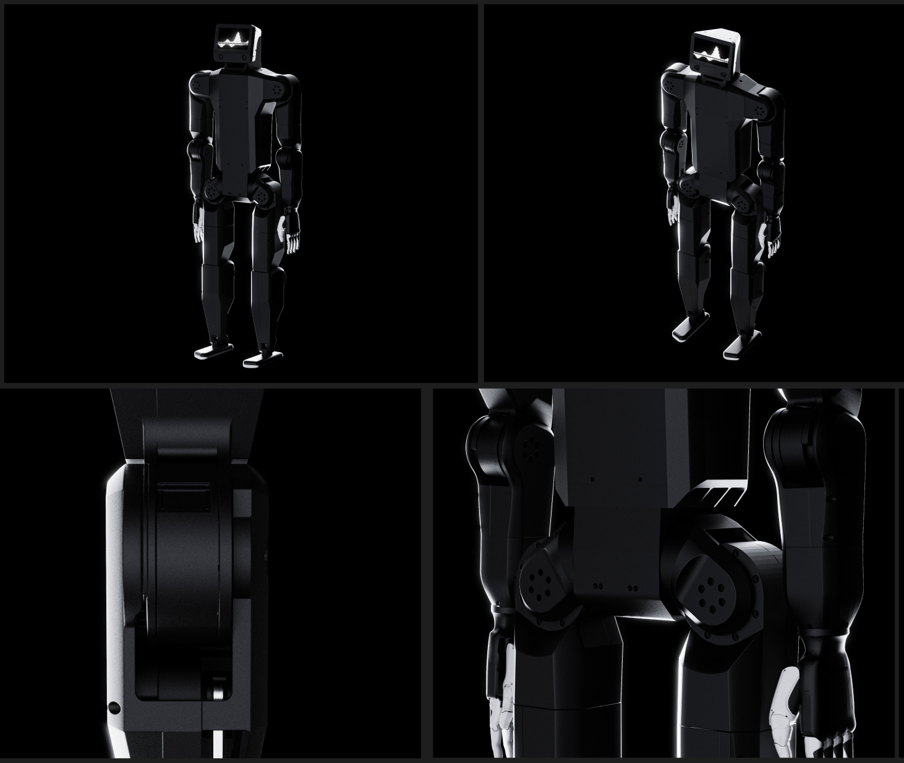

K-Scale Labs is a machine learning startup building software for the next generation of embodied artificial intelligence. Our [mission](https://url.kscale.dev/mission) is to move humanity to a Type 1 Kardashev civilization, by making general-purpose robotic intelligence ubiquitous. If you would like to build your own robot, or otherwise learn how to get involved, please [get in touch](https://url.kscale.dev/homepage).
